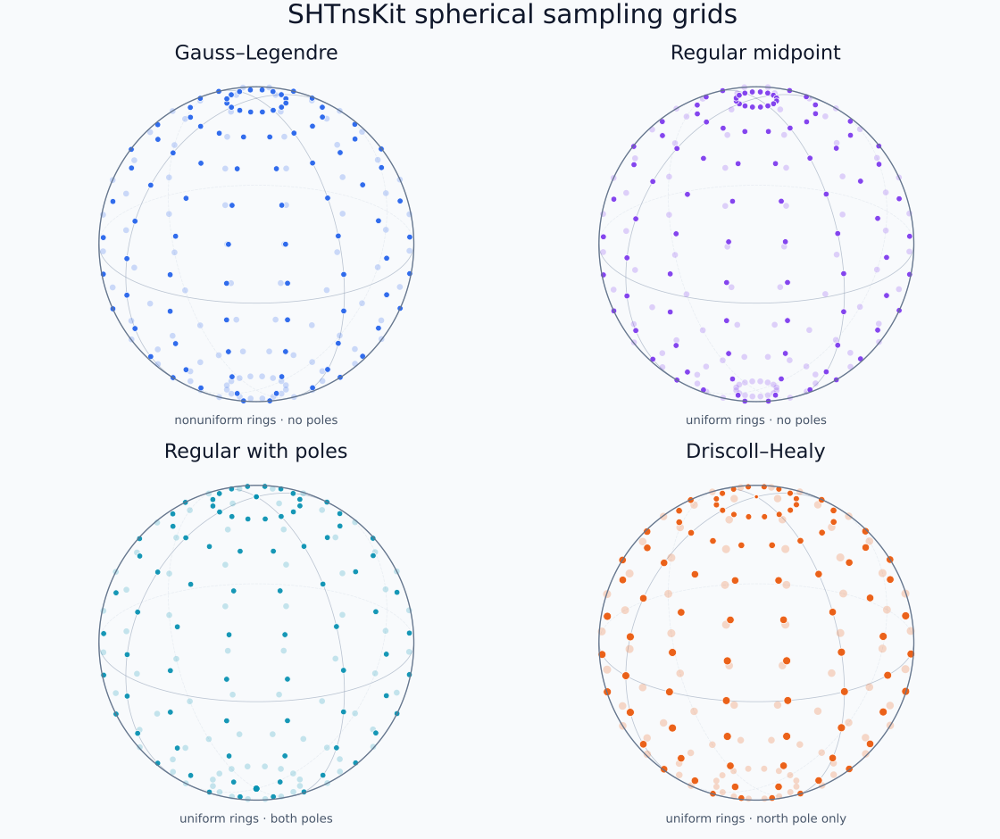

# Grid Types

Grid constructors validate sampling constraints immediately. Every grid stores
latitude in the first spatial dimension, longitude in the second, and uses
equally spaced longitudes. The important choice is how points are placed in
colatitude ``\theta`` from the north pole
(``\theta = 0``) to the south pole (``\theta = \pi``). The comparison below
uses the same 12 latitude samples and 16 longitudes in every panel, so the
different latitude patterns are directly comparable.

```@raw html
<figure class="grid-pattern-figure">
  <picture>
    <source media="(max-width: 700px)"
            srcset="assets/grid-patterns-stacked.svg">
    
  </picture>
  <figcaption>Faint dots lie on the far side of each globe. Driscoll–Healy dot size reflects quadrature weight.</figcaption>
</figure>
```

At a pole, all longitudes describe the same physical point, so their markers
overlap in the figure.

## Compare the sampling patterns

| Grid | Colatitudes | Pole samples | Good choice when… |
|:-----|:-------------|:-------------|:------------------|
| **Gauss–Legendre** | Roots of the degree-`nlat` Legendre polynomial | Neither | You want the default grid and the most accurate quadrature for a given number of latitudes. |
| **Regular midpoint (Fejér)** | ``\theta_i = (i + 1/2)\pi/n_\mathrm{lat}`` | Neither | Your data are cell-centred or already live on an equiangular image-like grid. |
| **Regular with poles** | ``\theta_i = i\pi/(n_\mathrm{lat}-1)`` | Both | Your external format requires explicit values at both poles. |
| **Driscoll–Healy** | ``\theta_i = i\pi/n_\mathrm{lat}`` | North only | You want equiangular sampling with Driscoll–Healy quadrature for band-limited transforms. |

Gauss–Legendre quadrature with `nlat` points integrates polynomials in
``x = \cos\theta`` through degree `2*nlat - 1` exactly. Driscoll–Healy
quadrature is exact at the intended band limit when `nlat = 2*(lmax + 1)`;
`nlat` must be even.

!!! tip "Which grid should I choose?"
    Start with Gauss–Legendre unless you need to exchange data with a particular
    equiangular layout. Use regular midpoint for cell-centred data, regular with
    poles for formats that store both endpoints, and Driscoll–Healy when its
    sampling theorem and quadrature weights are part of your numerical method.

## Gauss–Legendre

[`create_gauss_config`](@ref) is the default choice for numerical transforms:

```@example grids-gauss
using SHTnsKit

lmax = 32
cfg = create_gauss_config(lmax, lmax + 1; nlon=2lmax + 1)
(cfg.grid_type, cfg.nlat, cfg.nlon, sum(cfg.w))
```

Constraints:

- `nlat >= lmax + 1`
- `0 <= mmax <= lmax`
- `mres >= 1`
- `nlon >= 2*mmax + 1`

`create_gauss_fly_config` uses the same nodes while keeping Legendre recurrence
on the fly. `create_gauss_config_spf` creates the south-pole-first variant.

## Regular Fejér grid

The default regular grid uses midpoint colatitudes
`theta_i = (i + 1/2)π/nlat`, excluding both poles:

```@example grids-regular
using SHTnsKit

cfg = create_regular_config(32, 34; include_poles=false)
(cfg.grid_type, first(cfg.θ) > 0, last(cfg.θ) < π)
```

It requires `nlat >= lmax + 2` and `nlon >= 2*mmax + 1`. Associated Legendre
tables are precomputed by default; pass `precompute_plm=false` to favor a lower
initial memory footprint.

## Pole-inclusive regular grid

```@example grids-poles
using SHTnsKit

cfg = create_regular_config(32, 33; include_poles=true)
(first(cfg.θ), last(cfg.θ))
```

This grid includes both endpoints, requires `nlat >= lmax + 1`, and always
requires at least two latitudes. Pole-safe scalar and vector recurrences handle
the endpoint rows.

## Driscoll–Healy weights

Enable Driscoll–Healy quadrature on a pole grid:

```@example grids-dh
using SHTnsKit

lmax = 15
nlat = 2 * (lmax + 1)
cfg = create_regular_config(
    lmax, nlat;
    include_poles=true,
    use_dh_weights=true,
)
(cfg.grid_type, cfg.nlat)
```

`use_dh_weights=true` requires `include_poles=true` and an even `nlat`. Exact
sampling uses `nlat == 2*(lmax + 1)`; another even value is accepted with a
warning because it no longer has that exactness guarantee. The DH nodes include
the north pole and exclude the south pole.

## Common constructor

[`create_config`](@ref) selects a grid through `grid_type` and forwards the
normalization and sampling options. Prefer the specific constructors in user
code when the chosen grid should be obvious at the call site.

## Latitude order

New configurations are north-pole-first. Use `set_south_pole_first!` or
`set_north_pole_first!` before allocating/filling fields when an external data
source uses the opposite order. Query with `is_south_pole_first(cfg)`.

Do not reverse only the field: the field, nodes, quadrature weights, and tables
must use one consistent ordering.
